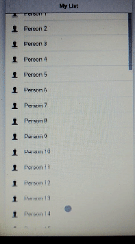

# ionic2-elastic-header

***ionic2-elastic-header*** is a directive for Ionic 2 and Ionic 3 to cause headers to shrink and reveal.



## Installation

```bash
npm install ionic2-elastic-header --save
```

### app.module.ts

* Import ElasticHeaderModule;
* Add ElasticHeaderModule in imports;

```typescript
import { NgModule, ErrorHandler } from '@angular/core';
import { IonicApp, IonicModule, IonicErrorHandler } from 'ionic-angular';
import { MyApp } from './app.component';
import { MyList } from '../pages/myList/myList';
import { ElasticHeaderModule } from "ionic2-elastic-header";

@NgModule({
  declarations: [
    MyApp,
    MyList
  ],
  imports: [
    IonicModule.forRoot(MyApp),
    ElasticHeaderModule //Add ElasticHeaderModule here
  ],
  bootstrap: [IonicApp],
  entryComponents: [
    MyApp,
    MyList
  ],
  providers: [{provide: ErrorHandler, useClass: IonicErrorHandler}]
})
export class AppModule {}
```

## Usage

* Add `elastic-header` attribute in `<ion-header>`;
* Add `fullscreen` attribute in `<ion-content>`;

### myList.html

```html
<!--Add the elastic-header attribute-->
<ion-header [elastic-header]="myContent">
  <ion-navbar>
    <ion-title>My List</ion-title>
  </ion-navbar>
</ion-header>
<!--Add the fullscreen attribute-->
<ion-content class="home" fullscreen>
  <ion-list>
    <ion-item *ngFor="let item of items">
      <ion-icon name="person" item-left></ion-icon>
      {{item.name}}
    </ion-item>
  </ion-list>
</ion-content>
```

### myList.ts

* Add value to elastic-header child in your class;

```typescript
import {Component, ViewChild} from '@angular/core';
import {Content} from 'ionic-angular';

@Component({
  selector: 'myList',
  templateUrl: 'myList.html'
})

export class MyList {

  //add the elastic-header value
  @ViewChild(Content) myContent: Content;
  items: any;

  constructor() {
    this.items = [];
    for(let i=0; i < 50; i++) {
      this.items.push({ name: `Person ${i}`})
    }
  }
}
```

## Licence

This project is licensed under the ISC license. See the [LICENSE](LICENSE.md) file for more info.
